# E-Commerce Web Application

### 👤 Vo Kim Long - 52200226

### 📚 Java Technology - Midterm Project

---

## 📌 Overview

A full-stack e-commerce platform built using **ReactJS**, **Spring Boot**, and **PostgreSQL** (Supabase). The application supports:

- 🔍 Product browsing & filtering
- 🛒 Cart & order management
- 🔐 JWT-based authentication
- 🌐 Google OAuth integration
- 🛠 Admin dashboard for managing products, users, and orders

---

## 🛠 Tech Stack

- **Frontend**: ReactJS, Redux Toolkit, Axios, TailwindCSS
- **Backend**: Spring Boot, Spring Data JPA, Spring Security, Lombok
- **Database**: PostgreSQL (Supabase)
- **Authentication**: JWT, Google OAuth
- **Testing**: JUnit, Mockito

---

## 📐 Architecture & Design

- **MVC Pattern** with layered architecture (Controller → Service → Repository)
- **RESTful API** communication between frontend and backend
- **SOLID principles**, clean code & separation of concerns

### Diagrams

- 
- 
- 

---

## 🚀 Getting Started

```bash
# Clone the repository
git clone https://github.com/LongKim11/E-Commerce-ReactJS-Spring-Boot

# Start Frontend
cd frontend
npm install
npm run dev

# Start Backend
cd backend/proathlete
./mvnw clean package # or use your IDE to build the project
java -jar target/<your-app>.jar
```

> Replace `<your-app>.jar` with the actual JAR file name (e.g., `proathlete-0.0.1-SNAPSHOT.jar`).

Or run with Docker:

```bash
docker build -t proathlete-backend .
docker run -p 8080:8080 proathlete-backend
```

---

## 📂 Project Structure

### Backend: `backend/proathlete`

- `auth/`: Authentication and authorization logic (JWT, OAuth)
- `controllers/`: REST API endpoints
- `services/`: Business logic
- `repositories/`: JPA Repositories for DB interaction
- `dto/`: Data transfer objects
- `entities/`: JPA entity classes
- `config/`: App configuration (swagger,...)
- `exceptions/`: Custom exceptions
- `enums/`: Enum types used in the app

### Frontend: `frontend`

- `components/`: Reusable UI elements
- `pages/`: Main views/screens of the app
- `api/`: API call functions
- `services/`: Business logic & data handling
- `store/`: Redux Toolkit store and slices
- `layout/`: Common layout components (Navbar, Footer, etc.)
- `utils/`: Utility functions

---

## 📬 API Testing (Postman)

Screenshots for major API requests & responses:

- 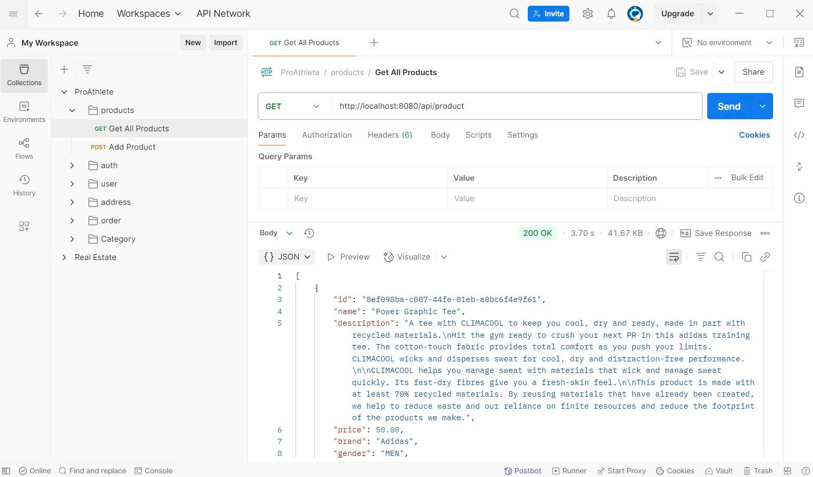
- 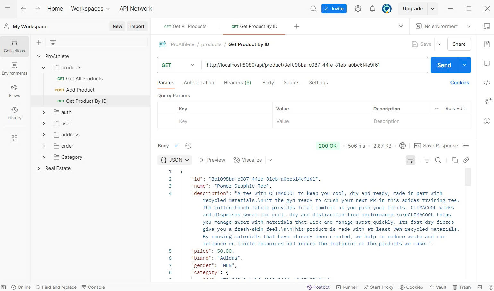
- 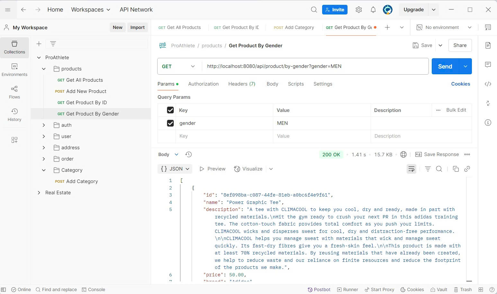
- 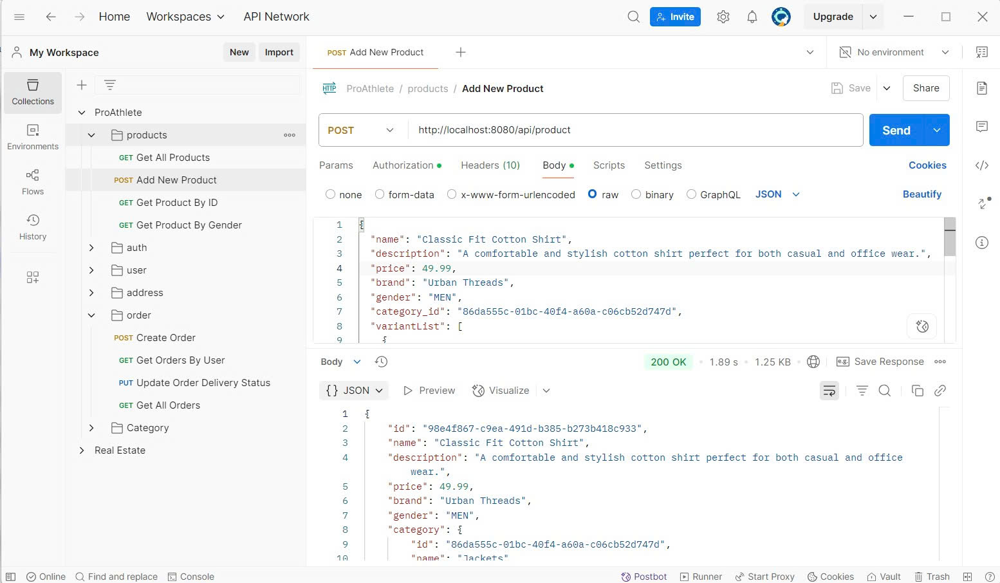
- 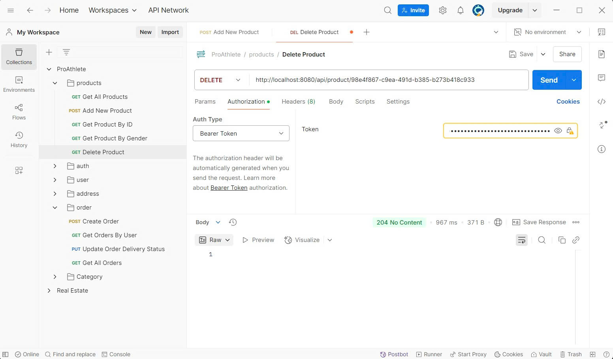
- 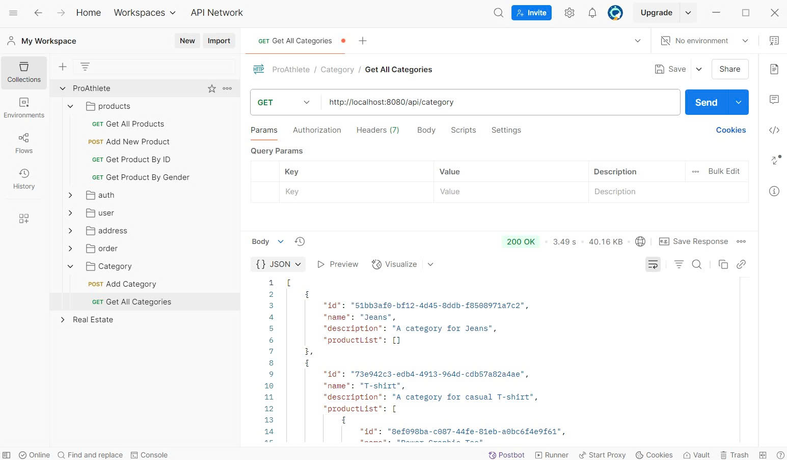
- 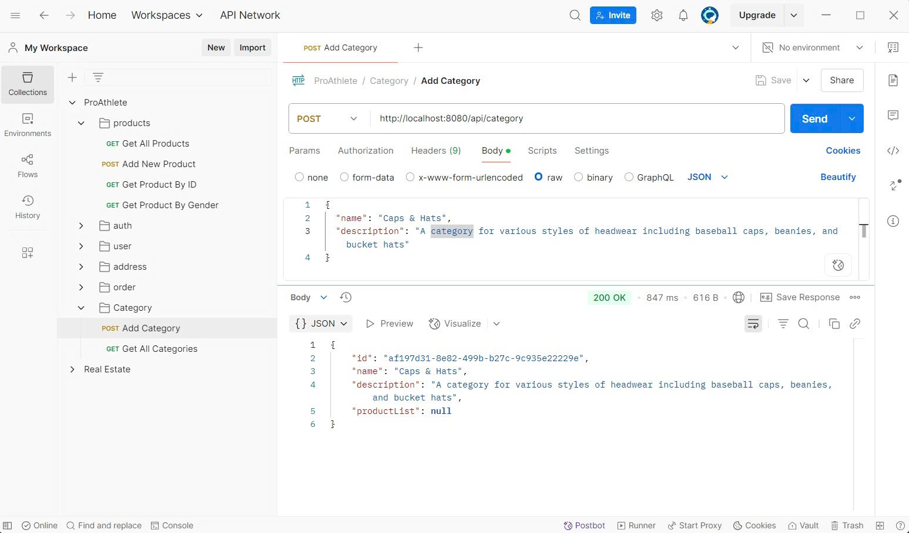
- 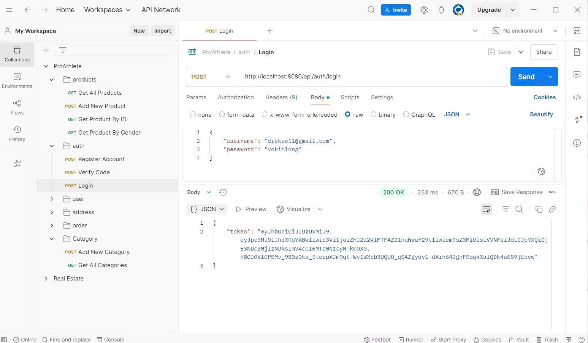
- 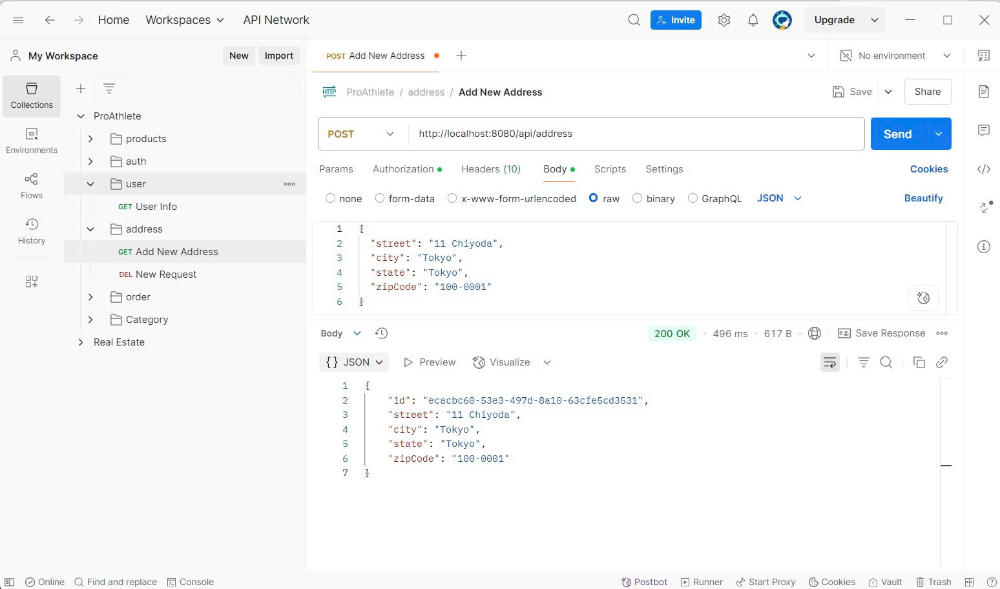
- 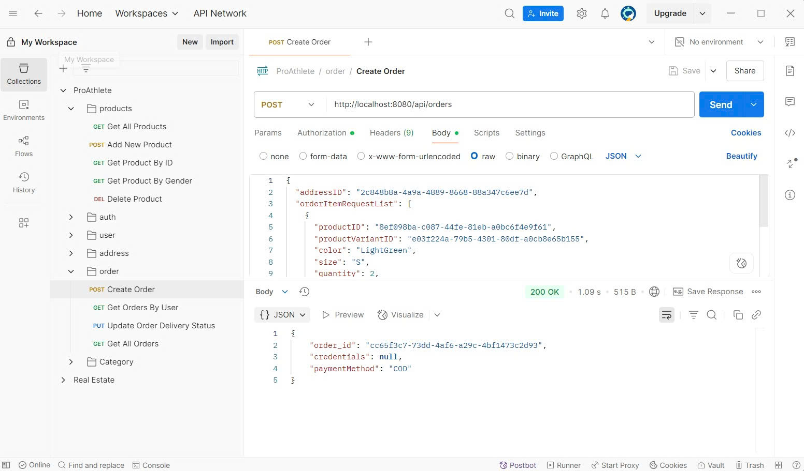
- 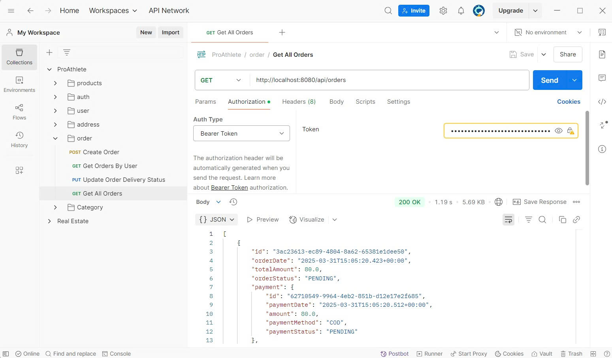
- 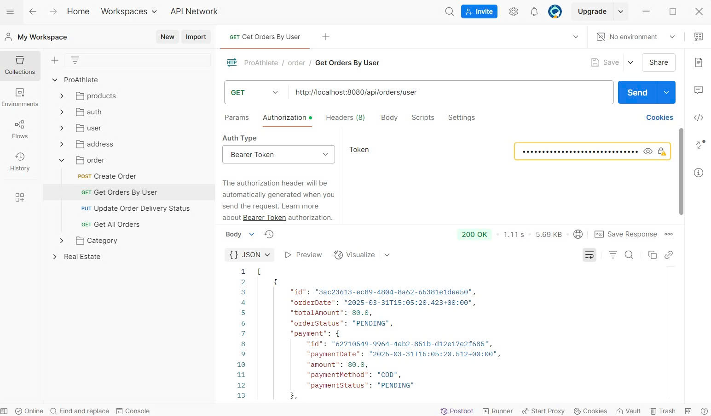
- 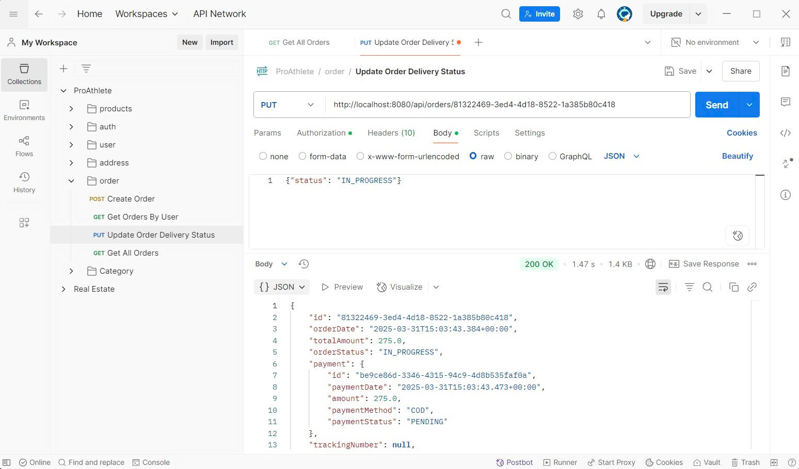
- 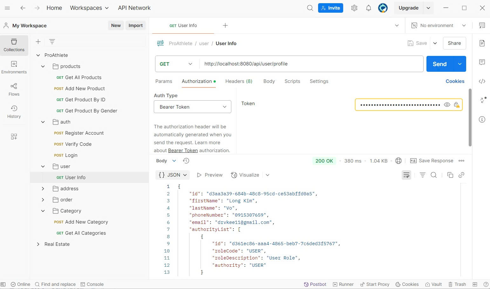

---

## 🎯 Key Highlights

- 🧩 Modular, reusable component-based UI
- 🧠 State management with Redux Toolkit
- 📦 JWT & OAuth-secured API endpoints
- ✅ Unit testing with JUnit & Mockito
