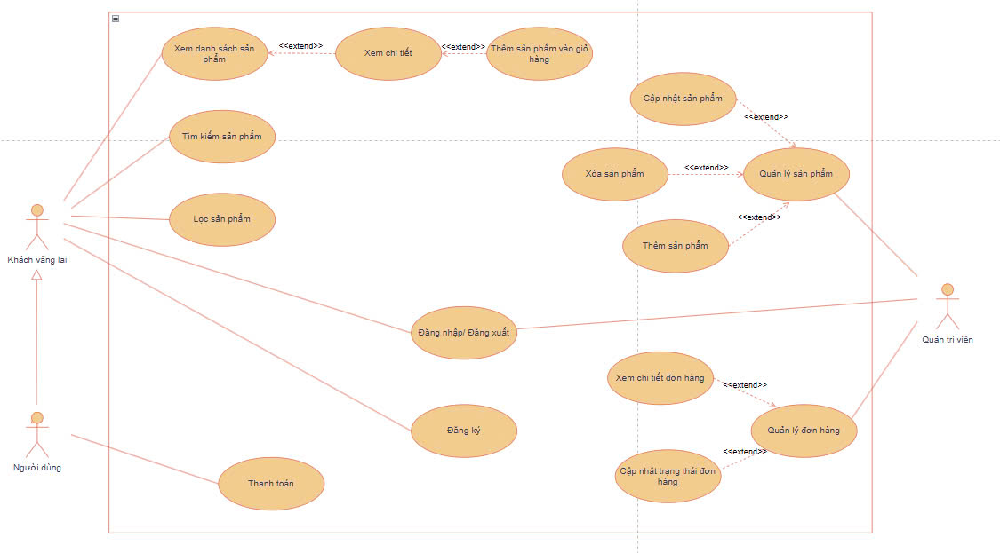
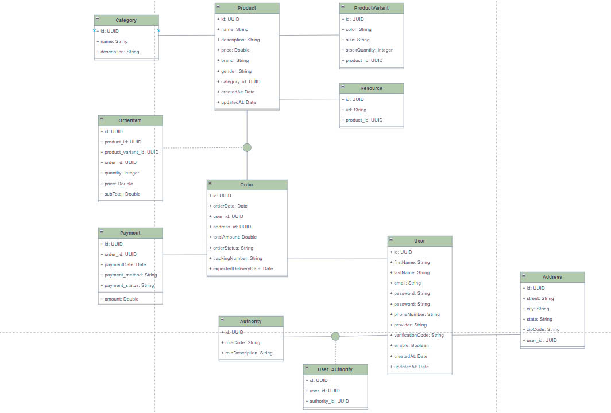

# 52200226 - Vo Kim Long

# Midterm Project - Java Technology

# E-Commerce Web Application (ReactJS + Spring Boot)

## 1. Introduction

- E-Commerce web application built with **ReactJS**, **Spring Boot**, and **PostgreSQL** (via Supabase).
- Key features: Product browsing, detailed view, cart management, and advanced filtering.
- Two main actors:
  - **Customers**: Browse products, view details, filter, and place orders.
  - **Admin**: Manage products, orders, and customers.

## 2. Tech Stack

- **Frontend**: ReactJS, Redux Toolkit, React Router, Axios, TailwindCSS.
- **Backend**: Spring Boot, Spring Data JPA, Spring MVC, Spring Security, Lombok.
- **Database**: PostgreSQL (Supabase).
- **Authentication**: JWT.
- **Testing**: JUnit, Mockito.

## 3. System Design

- **Use Case Diagram**
  

- **ERD**
  

- **Database Schema**
  

## 4. Software Development Principles

- Applied **SOLID principles** for maintainability and scalability.
- Implemented **Separation of Concerns (SoC)** across layers (Controller, Service, Repository).
- Followed the **Waterfall methodology** for a sequential and structured development process.

## 5. Architecture and Design Patterns

- Adopted **MVC** for application structure, with **Controller** handling requests.
- Implemented **RESTful API** for efficient and structured communication between services.
- Applied **Dependency Injection** to reduce coupling between components.

## 6. Development Practices

- Followed **clean code** principles for readability and maintainability.
- Implemented **layered architecture** for modularity and separation of concerns.
- Wrote **unit tests** to ensure software quality and reliability.
