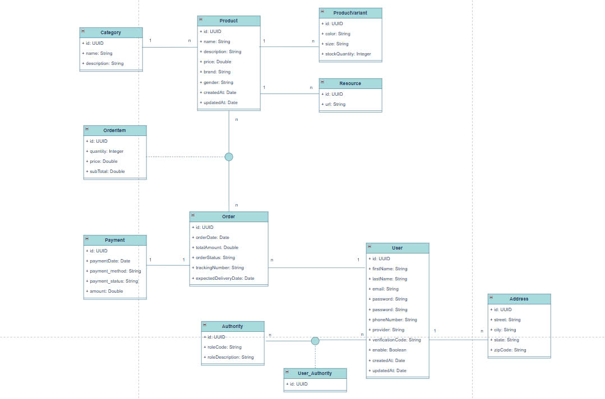

# 52200226 - Vo Kim Long

# Midterm Project - Java Technology

# E-Commerce Web Application (ReactJS + Spring Boot)

## 1. Introduction

- E-Commerce web application built with **ReactJS**, **Spring Boot**, and **PostgreSQL** (via Supabase).
- Key features: Product browsing, detailed view, cart management, and advanced filtering.
- Two main actors:
  - **Customers**: Browse products, view details, filter, and place orders.
  - **Admin**: Manage products, orders, and customers.

## 2. Tech Stack

- **Frontend**: ReactJS, Redux Toolkit, React Router, Axios, TailwindCSS.
- **Backend**: Spring Boot, Spring Data JPA, Spring MVC, Spring Security, Lombok.
- **Database**: PostgreSQL (Supabase).
- **Authentication**: JWT.
- **Testing**: JUnit, Mockito.

## 3. System Design

### 3.1. Use Case Diagram

### 3.2. ERD (Entity Relationship Diagram)

### 3.3. Database Schema

## 4. Software Development Principles

- Applied **SOLID principles** for maintainability and scalability.
- Implemented **Separation of Concerns (SoC)** across layers (Controller, Service, Repository).
- Followed the **Waterfall methodology** for a sequential and structured development process.

## 5. Architecture and Design Patterns

- Adopted **MVC** for application structure, with **Controller** handling requests.
- Implemented **RESTful API** for efficient and structured communication between services.
- Applied **Dependency Injection** to reduce coupling between components.

## 6. Development Practices

- Followed **clean code** principles for readability and maintainability.
- Implemented **layered architecture** for modularity and separation of concerns.
- Wrote **unit tests** to ensure software quality and reliability.

## 7. Code Structure

### 7.1 Backend

- **`src/`**: Source code directory.
  - **`main/`**: Main application source code.
    - **`java/com/longkimvo/proathlete/`**: Main Java package.
      - **`auth/`**: Authentication-related classes.
      - **`config/`**: Application configuration files.
      - **`controllers/`**: REST API controllers.
      - **`dto/`**: Data Transfer Objects for request/response.
      - **`entities/`**: JPA entities representing database tables.
      - **`enums/`**: Enumerations used in the application.
      - **`exceptions/`**: Custom exception classes.
      - **`repositories/`**: Spring Data JPA repositories for database interaction.
      - **`services/`**: Business logic implementations.
    - **`resources/`**: Application resources (e.g., properties, static files).
  - **`test/`**: Unit tests for the application.

### 7.2 Frontend

- **`public/`**: Holds static assets served directly by the web server (e.g., images, fonts).
- **`src/`**: Main source code directory.
  - **`api/`**: Handles API interactions and data fetching.
  - **`assets/`**: Contains static assets used by the application (e.g., images, icons).
  - **`components/`**: Reusable UI components.
  - **`data/`**: Stores local or static data.
  - **`layout/`**: Defines the overall structure and common elements of pages.
  - **`pages/`**: Contains individual application views or screens.
  - **`services/`**: Implements business logic and often interacts with the `api` layer.
  - **`store/`**: Manages the application's state (React Redux).
  - **`utils/`**: Utility functions and helper methods.
  - **`index.css`**: Global CSS styles.
  - **`main.jsx`**: Entry point of the application.
  - **`routes.jsx`**: Defines application routes and navigation.
